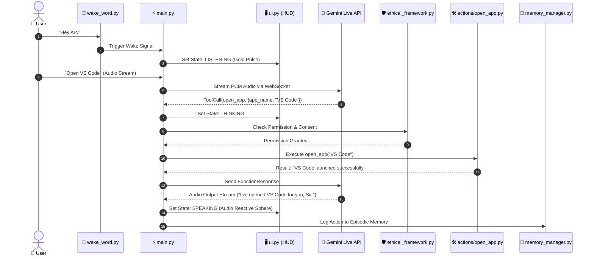

# ⚡ ARC — Adaptive Real-Time Cognitive Agent
## Complete Documentation v1.0 — For Absolute Beginners (Every File Explained)

---

## 📖 Table of Contents
1. [🌟 What is ARC?](#-what-is-arc)
2. [🏢 Section 1: The Big Picture — How ARC Works](#-section-1-the-big-picture--how-arc-works)
3. [📂 Section 2: Complete File Structure — Every File Explained](#-section-2-complete-file-structure--every-file-explained)
   - [Root Folder Files](#-root-folder-files)
   - [Config Folder (`config/`)](#-config-folder-config)
   - [Core Folder (`core/`)](#-core-folder-core)
   - [Memory Folder (`memory/`)](#-memory-folder-memory)
   - [Actions Folder (`actions/`)](#-actions-folder-actions)
   - [Plugins Folder (`plugins/`)](#-plugins-folder-plugins)
   - [Dashboard Folder (`dashboard/`)](#-dashboard-folder-dashboard)
   - [Security Folder (`security/`)](#-security-folder-security)
   - [Logs Folder (`logs/`)](#-logs-folder-logs)
   - [Scripts Folder (`scripts/`)](#-scripts-folder-scripts)
   - [Tests Folder (`tests/`)](#-tests-folder-tests)
4. [🔄 Section 3: How Each Part Talks to Each Other](#-section-3-how-each-part-talks-to-each-other)
5. [📥 Section 4: The 5 Input Types Explained](#-section-4-the-5-input-types-explained)
6. [🧠 Section 5: The Memory System Explained Simply](#-section-5-the-memory-system-explained-simply)
7. [🏆 Section 6: The 4 Hackathon Tracks](#-section-6-the-4-hackathon-tracks)
8. [🚀 Section 7: Startup Sequence Step by Step](#-section-7-startup-sequence-step-by-step)
9. [📦 Section 8: What Each Python Library Does](#-section-8-what-each-python-library-does)
10. [🗣️ Section 9: Common Voice & Gesture Commands Reference](#️-section-9-common-voice--gesture-commands-reference)
11. [🛠️ Section 10: Troubleshooting Guide](#️-section-10-troubleshooting-guide)

---

## 🌟 What is ARC?

**ARC (Adaptive Real-Time Cognitive Agent)** is a voice-first AI assistant designed to run directly on your Windows PC. You say **"Hey Arc"** and it wakes up immediately. You speak to it in natural human language, and it performs real-world actions: opening applications, analyzing your screen, searching the web, controlling mouse and keyboard, taking notes, tracking your medications, managing system security, and continuously learning from your habits and corrections.

```
┌──────────────┐     ┌───────────┐     ┌─────────────┐     ┌───────────┐     ┌──────────────┐
│  You Speak   │ ──► │ ARC Hears │ ──► │  ARC Thinks │ ──► │  ARC Acts │ ──► │  ARC Speaks  │
│  "Hey Arc"   │     │ (Mic/PCM) │     │ (Gemini/LLM)│     │ (50+ Tools)│     │  Back to You │
└──────────────┘     └───────────┘     └─────────────┘     └───────────┘     └──────────────┘
```

> [!NOTE]
> **Privacy-First Guarantee**: ARC is powered by Google's Gemini AI, but all personal memory, documents, health records, notes, and telemetry stay securely on your local PC. Nothing private leaves your machine without your explicit consent.

---

## 🏢 Section 1: The Big Picture — How ARC Works

Imagine ARC as an enterprise organization with specialized departments working in harmony:

| Department | ARC Subsystem | Everyday Analogy | Primary Responsibility |
| :--- | :--- | :--- | :--- |
| **Reception** | `core/wake_word.py` | The Front Door Bell | Sits at the door listening 24/7 for *"Hey Arc"*. When heard, opens the communication channel. |
| **Brain** | Gemini Live WebSocket | Executive Boardroom | Google Gemini 2.0 Live API reasons over speech, plans multi-step workflows, and decides which actions to call. |
| **Hands** | `actions/` & `plugins/` | The Operations Staff | Over 50 reinforced tools that interact with your PC: files, browser, applications, media, and diagnostics. |
| **Memory** | `memory/memory_manager.py` | Institutional Library | Remembers facts, learns from corrections, indexes documents as vectors, and gets smarter over time. |
| **Security Guard**| `plugins/threat_monitor.py` | Cyber Defense Patrol | Runs 5 daemon threads monitoring processes, network sockets, file modifications, authentication, and RAM. |
| **Phone Link** | `dashboard/server.py` | Receptionist Extension | FastAPI web app allowing you to monitor and control ARC or mirror your screen from your mobile phone. |
| **Face** | `ui.py` | Cybernetic HUD Sphere | Smooth 60 FPS golden kinetic HUD visualizing ARC's state (Idle, Listening, Thinking, Speaking, Threat). |

---

## 📂 Section 2: Complete File Structure — Every File Explained

```
arc/
├── main.py                   # The Heart of ARC (Application Lifecycle & WebSocket Orchestrator)
├── ui.py                     # The Face of ARC (PyQt6 Cybernetic 60 FPS HUD & Telemetry Panels)
├── setup.py                  # The Installer (Bootstrap Python libraries & configurations)
├── run.bat                   # The Launcher (One-click batch runner for Windows)
├── requirements.txt          # The Shopping List (Exact library versions needed by ARC)
├── conftest.py               # Test Helper (Global test fixtures & mock device wrappers)
├── readme.md                 # The Manual (High-level architecture & quick-start guide)
├── DOCUMENTATION.md          # This complete beginner's handbook
├── config/                   # Settings, cryptographic keys, and user preferences
├── core/                     # Central nervous system, audio, and safety guards
├── memory/                   # Vector stores, episodic memory, and user profile
├── actions/                  # 50+ Auto-discovered tool modules
├── plugins/                  # Drop-in background daemons & peripheral monitors
├── dashboard/                # Mobile web server & remote interface
├── security/                 # Threat blacklist, incident reports, and quarantine vault
├── logs/                     # Operational logs and microsecond latency records
├── scripts/                  # Shortcuts, GPU environment scripts, and helper utilities
└── tests/                    # 200+ unit, integration, and load tests
```

---

### 🌟 Root Folder Files

- **`main.py`** — **The Heart of ARC**:
  The central nervous system and entry point. It coordinates the lifecycle of all subsystems: initializes configuration, starts background daemons, opens the bidirectional Gemini Live WebSocket, captures audio through `sounddevice`, routes tool calls, and synchronizes the UI HUD state.
- **`ui.py`** — **The Face of ARC**:
  Everything visible on screen. Built with PyQt6 and hardware-accelerated rendering. Draws the 60 FPS gold cybernetic particle sphere, system telemetry meters, quick action toggles, memory viewer with virtual pagination, and the 30 FPS camera console with landmark overlays.
- **`setup.py`** — **The Installer**:
  Run once when first setting up ARC. It validates the Python version (3.10+), installs all required wheels and packages from `requirements.txt`, creates default directories, and pre-configures user settings.
- **`run.bat`** — **The Windows Launcher**:
  A double-clickable Windows batch script that activates the virtual environment (if present) and executes `python main.py` with the correct environment variables.
- **`requirements.txt`** — **The Shopping List**:
  Pins dependencies for ARC across audio (`sounddevice`), vision (`mediapipe`, `opencv-python`), AI (`google-genai`, `sentence-transformers`), GUI (`PyQt6`), networking (`fastapi`, `uvicorn`), and security (`cryptography`).
- **`conftest.py`** — **The Test Fixture Root**:
  Pytest configuration that sets up mock sound hardware and offscreen display contexts so that the entire test suite runs cleanly in continuous integration and command-line environments.
- **`readme.md`** — **The Architectural Overview**:
  The primary GitHub README documenting system specs, hardware offloading, and developer instructions.

---

### ⚙️ Config Folder (`config/`)

- **`config/api_keys.json`** — **Encrypted Secret Vault**:
  Stores your Gemini API key, user title ("Sir"), voice selection ("en-US-GuyNeural"), and device identifiers. Encrypted at rest via Fernet AES keys derived from machine hardware IDs.
- **`config/arc.ico`** — **Brand Asset**:
  The high-resolution golden cybernetic sphere icon used for the Windows taskbar, window title bar, and desktop shortcuts.
- **`config/consents.json`** — **Privacy Ledger**:
  Stores persistent user permissions for webcam, filesystem access, network monitoring, and health tracking.

---

### 🧠 Core Folder (`core/`)

- **`core/action_loader.py`** — **Dynamic Tool Discoverer**:
  Auto-scans the `actions/` directory at startup. Dynamically imports every valid `.py` file containing a `TOOL` dictionary and registers it with the Gemini tool dispatcher without requiring manual imports.
- **`core/plugin_loader.py`** — **Plugin Discoverer**:
  Scans `plugins/` for background daemons and optional peripheral modules matching the `PLUGIN` contract. Allows hot-reloading and toggling plugins at runtime.
- **`core/prompt.txt`** — **ARC's Personality & Grounding Constitution**:
  The system prompt injected into Gemini. Enforces professionalism, concise tone, priority of user corrections, strict avoidance of medical diagnosis, and ethical constraints.
- **`core/wake_word.py`** — **The Doorbell**:
  A lightweight, continuous background audio worker using openWakeWord (ONNX). Listens offline for the phrase *"Hey Arc"* with `< 2%` CPU utilization.
- **`core/audio_devices.py`** — **Audio Device Manager**:
  Enumerates host microphones and audio output endpoints, allowing dynamic switching and storing device preferences.
- **`core/confirm.py`** — **Safety Gate**:
  Interception layer for destructive operations (file deletion, process termination, system shutdown). Displays an interactive 30-second confirmation dialog before execution.
- **`core/undo.py`** — **Action History & Rollback**:
  Maintains an undo stack of reverse actions (e.g., restoring moved files, reverting volume changes) triggered via voice: *"ARC, undo"*.
- **`core/greeting.py`** — **Offline Morning Briefer**:
  Generates contextual greetings upon startup without requiring cloud connectivity by introspecting time, battery, CPU, and RAM metrics.
- **`core/logger.py`** — **Audit Logger & Secret Scrubber**:
  Rotating file logger writing to `logs/arc.log`. Automatically sanitizes credentials, tokens, and API keys with `[REDACTED]`.
- **`core/self_check.py`** — **System Diagnostics Engine**:
  Pre-flight verification checking microphone availability, speakers, camera, internet connectivity, and API authentication before starting the main loop.
- **`core/self_awareness.py`** — **Introspection & Capability Registry**:
  Maintains a live, real-time map of all loaded tools, active plugins, and operational metrics. Injects this capability list into the prompt so ARC knows exactly what it can and cannot do.
- **`core/stt.py`** — **Offline Speech-To-Text**:
  Local speech recognition fallback using Faster-Whisper and Vosk when internet connectivity is severed.
- **`core/tts.py`** — **Text-To-Speech Synthesizer**:
  Manages speech synthesis via EdgeTTS (cloud neural), Kokoro (local neural), or ElevenLabs.
- **`core/llm_client.py`** — **Local Backup Brain**:
  Client for offline LLMs (Ollama, LM Studio) running Llama 3 or Mistral when the cloud Gemini API is unreachable.
- **`core/installer.py`** — **Self-Healing Package Manager**:
  Detects missing optional runtime dependencies and prompts or automates installation in the background.
- **`core/latency_optimizer.py`** — **Speed Booster**:
  Manages connection pre-warming, TTL caching for idempotent tools, and microsecond latency instrumentation.
- **`core/bandwidth_monitor.py`** — **Adaptive Network Watcher**:
  Measures network throughput every 10 seconds and categorizes connectivity into HIGH, MEDIUM, LOW, or CRITICAL tiers to dynamically adjust video and audio bitrates.
- **`core/ethical_framework.py`** — **The Conscience**:
  Intercepts every tool call before execution to verify user consent, evaluate risk level, and log decisions to an audit trail.

---

### 💾 Memory Folder (`memory/`)

- **`memory/memory_manager.py`** — **The Central Memory Controller**:
  Coordinates personal user preferences, vector embeddings, and semantic similarity search over historical lessons.
- **`memory/long_term.json`** — **Permanent User Profile**:
  Stores static user facts (name, university, field, project names, preferred languages, and code editors).
- **`memory/semantic_store.json`** — **The Lesson Book**:
  Stores learned lessons, corrections, and tips encoded as 384-dimensional dense vectors.
- **`memory/episodes.json`** — **Conversation Summaries**:
  Per-session narrative summaries capturing goals achieved, tools utilized, and user feedback.
- **`memory/pending_tasks.json`** — **Unfinished Business**:
  Tracks multi-step workflows across application restarts so ARC can resume incomplete tasks.
- **`memory/health_data.json`** — **Encrypted Health Log**:
  Stores wearable biometrics, medication regimens, and adherence logs with hardware-bound encryption.
- **`memory/config_manager.py`** — **Thread-Safe Configuration IO**:
  Protects configuration and memory JSON files from race conditions using thread locks and atomic writes.
- **`memory/notes/`** — **User Notebook**:
  Markdown notes created via voice commands (*"ARC, make a note..."*).

---

### 🛠️ Actions Folder (`actions/`)

Each action implements a self-contained capability and defines a standardized `TOOL` dictionary:

| Action Module | Description & Voice Trigger |
| :--- | :--- |
| **`open_app.py`** | Finds and launches Windows desktop applications (*"ARC, open VS Code"*). |
| **`file_controller.py`** | Safe filesystem operations with recycle bin deletion (*"ARC, move reports to desktop"*). |
| **`file_intelligence.py`** | Content-hash duplicate detection and disk space cleanup (*"ARC, clean downloads"*). |
| **`file_processor.py`** | Document text extraction across PDF, PPTX, XLSX, DOCX, and TXT files. |
| **`web_search.py`** | DuckDuckGo search across Research, News, Fact-Check, and Price modes. |
| **`browser_control.py`** | Automated browser navigation and DOM interaction via Playwright. |
| **`computer_control.py`** | Cross-platform mouse movements, clicks, and keyboard strokes via PyAutoGUI. |
| **`computer_settings.py`** | Windows volume, brightness, dark mode, and power state controls. |
| **`window_manager.py`** | Application window snapping, minimizing, and layout arrangement. |
| **`system_monitor.py`** | Hardware telemetry for CPU, RAM, GPU VRAM, temperatures, and battery. |
| **`system_diagnostics.py`**| Deep hardware and network interface diagnostic tests. |
| **`screen_processor.py`** | Ultra-fast desktop screenshot capture and silent OCR background analysis. |
| **`quick_notes.py`** | Voice-driven markdown note creation, querying, and deletion. |
| **`reminder.py`** | Timed alarms and scheduled desktop toast notifications. |
| **`daily_briefing.py`** | Daily briefing compiling weather, reminders, and system health. |
| **`weather_report.py`** | Real-time weather forecasts and meteorological observations. |
| **`dev_agent.py`** | Autonomous multi-file software engineering, testing, and debugging. |
| **`code_helper.py`** | Multi-language syntax analysis, complexity estimation, and sandboxed code execution. |
| **`send_message.py`** | Formatting and dispatching local communications and email drafts. |
| **`youtube_video.py`** | YouTube video playback management and transcript extraction. |
| **`flight_finder.py`** | Flight schedule and airfare comparison search. |
| **`desktop.py`** | Desktop file sorting and clutter organization. |
| **`background_monitor.py`** | Continuous topic polling and alert notification. |
| **`proactive.py`** | Ergonomic health reminders and unprompted break check-ins. |
| **`whatsapp_call_screening.py`**| Desktop messaging and audio call screening. |
| **`game_updater.py`** | Game client and gaming library launcher. |
| **`research_agent.py`** | 5-stage parallel query decomposition and academic paper synthesis. |
| **`document_intelligence.py`** | Contract analysis, clause comparison, and liability risk extraction. |
| **`fact_checker.py`** | Cross-source claim verification with mandatory citation of evidence. |
| **`complaint_triage.py`** | Categorization, severity scoring, and routing of civic complaints. |
| **`network_diagnosis.py`** | Multi-hop network diagnostics (DNS, Gateway, ISP, Target). |
| **`procurement_agent.py`** | Vendor quote normalization and comparison matrix generation. |
| **`reproducibility_agent.py`**| Academic research paper reproducibility assessment and data leakage screening. |
| **`compliance_tracker.py`** | Regulatory requirement deadline tracking and compliance audit generation. |
| **`pattern_risk_agent.py`** | Time-series data anomaly detection and risk correlation over CSVs. |
| **`cyber_shield.py`** | Voice-command security interface for process termination and IP firewall rules. |
| **`defender_control.py`** | PowerShell bridge to manage Windows Defender scans and signature updates. |
| **`symptom_checker.py`** | Clinical intake and 4-tier care triage with mandatory medical disclaimers. |
| **`medical_document_analyzer.py`**| Lab report biomarker analysis and reference range extraction. |
| **`medication_manager.py`**| Medication schedule tracking, adherence logs, and drug interaction alerts. |
| **`health_monitor.py`** | Wearable biometric analysis across heart rate, sleep, steps, and activity. |
| **`prior_auth_agent.py`** | Insurance prior-authorization clinical documentation preparation. |
| **`content_studio.py`** | Technical writing, executive summary, and documentation generation. |
| **`meeting_summarizer.py`** | Audio transcription and action-item extraction from meetings. |
| **`presentation_builder.py`**| Generation of 10-slide PowerPoint presentations (`.pptx`) with speaker notes. |
| **`image_generator.py`** | Image generation using Gemini visual models. |
| **`transparency_report.py`** | Plain-English explanations of all automated decisions and memory usage. |
| **`bias_detector.py`** | Neutrality analysis and alternative perspectives for controversial topics. |
| **`consent_manager.py`** | Granular permission inspection, granting, and revocation. |
| **`data_sovereignty.py`** | GDPR-compliant personal data export and complete memory wipe. |

---

### 🔌 Plugins Folder (`plugins/`)

- **`plugins/_template.py`** — **Plugin Starter Template**:
  A fully documented blueprint demonstrating how developers can create custom background daemons with lifecycle hooks (`on_start`, `on_tick`, `on_stop`).
- **`plugins/screen_mirror.py`** — **Remote Screen Mirror Streamer**:
  WebSocket daemon streaming compressed screen frames to the mobile dashboard with bandwidth-adaptive frame rates (1–12 FPS) and delta-compression.
- **`plugins/threat_monitor.py`** — **Cyber Defense Daemon (5 Threads)**:
  - *Thread 1 (Process Watch)*: Scans running tasks every 10s for ransomware, coin miners, and code injection.
  - *Thread 2 (Network Watch)*: Scans socket connections every 15s for suspicious external IPs and port scans.
  - *Thread 3 (File Watch)*: Real-time file system observer detecting mass renames and unauthorized executables.
  - *Thread 4 (Auth Watch)*: Windows Event Log monitor tracking logon anomalies and privilege escalations.
  - *Thread 5 (Memory Watch)*: Memory scanner detecting unmapped executable pages every 30s.
- **`plugins/defender_monitor.py`** — **Windows Defender Event Consumer**:
  Listens for Defender threat events; upon detection, immediately triggers audio alerts, shifts HUD color to crimson, and logs an incident report.
- **`plugins/permission_auditor.py`** — **Least-Privilege Self-Auditor**:
  Periodically inspects loaded tools against actually utilized resources to report over-permissioned components.
- **`plugins/gesture_control.py`** — **Optical Hand Gesture Recognition**:
  30 FPS background engine tracking 21 hand landmarks via MediaPipe. Classifies 20 discrete gestures (15 single-hand + 5 dual-hand) with debouncing and hold detection.

---

### 📱 Dashboard Folder (`dashboard/`)

- **`dashboard/server.py`** — **FastAPI Web Application**:
  Hosts the local remote dashboard on port 8000. Serves static assets, pairs mobile devices via QR code tokens, handles two-way WebSocket communications, and secures traffic with AES-256 encryption.
- **`dashboard/static/login.html`** — **Pairing Screen**:
  Mobile login page allowing QR scan pairing or token authentication. Works offline via Service Worker caching.
- **`dashboard/static/app.html`** — **Mobile Cybernetic Console**:
  Tabbed web interface providing:
  1. *Chat Console*: Real-time bidirectional voice/text interaction.
  2. *Screen Mirror*: Live streaming view of the host PC.
  3. *Hardware Telemetry*: Real-time gauges for CPU, RAM, GPU, battery, and threat status.
  4. *Quick Action Ribbon*: Remote emergency stop, mic toggle, and macro buttons.
- **`dashboard/static/crypto-js.min.js`** — **Client Cryptography**:
  Implements client-side AES-256 decryption so telemetry remains confidential even over shared public networks.

---

### 🛡️ Security Folder (`security/`)

- **`security/threat_db.json`** — **Threat Signatures & Whitelist**:
  Local threat database containing known malicious process names, C2 IP addresses, ransomware extensions, and trusted application hashes.
- **`security/incidents/`** — **Incident Vault**:
  Stores auto-generated Markdown security reports detailing timestamps, detected processes, attack pathways, and automated mitigations.
- **`security/quarantine/`** — **Isolation Sandbox**:
  Secure holding folder where malicious files are moved, renamed, and stripped of execute permissions.

---

### 📝 Logs Folder (`logs/`)

- **`logs/arc.log`** — **Main System Audit Trail**:
  Comprehensive log file recording startup events, tool calls, user queries, and error stack traces (capped at 10MB, rotating across 5 generations).
- **`logs/latency.log`** — **Microsecond Timing Log**:
  Detailed measurements covering wake-word reaction times, WebSocket network latency, tool execution times, and TTS audio playout delay.

---

### 📜 Scripts Folder (`scripts/`)

- **`scripts/create_shortcut.py`** — Creates a Windows desktop shortcut pointing to `run.bat` with `arc.ico`.
- **`scripts/set_nvidia_gpu.bat`** / **`set_nvidia_gpu.py`** — Configures Windows Graphics Performance Preference to run ARC on the dedicated discrete GPU (NVIDIA RTX/GTX).
- **`scripts/setup_windows.bat`** — Automated script for creating virtual environments and installing system wheels.

---

### 🧪 Tests Folder (`tests/`)

- **`tests/test_arc_vigorous.py`** — The flagship test suite featuring **201 exhaustive tests** covering self-awareness, low latency, heavy load, ethical AI, edge cases, and brand verification.
- **`tests/test_gesture_reinforced.py`** — 40 dedicated tests (**GR01–GR40**) verifying the 20-gesture matrix, state-machine debouncing, hold detectors, and camera console rendering.
- **Subsystem Test Modules** (`test_a` through `test_l`) validating environment, core, memory, tools, plugins, security, dashboard, and UI.

---

## 🔄 Section 3: How Each Part Talks to Each Other



---

## 📥 Section 4: The 5 Input Types Explained

```
                  ┌───────────────────────────────────────────────┐
                  │              ARC INPUT CHANNELS               │
                  └───────┬───────┬───────┬───────┬───────┬───────┘
                          │       │       │       │       │
       ┌──────────────────┘       │       │       │       └──────────────────┐
       ▼                          ▼       ▼       ▼                          ▼
┌──────────────┐             ┌────────┐ ┌────┐ ┌──────┐                ┌───────────┐
│ 1. Voice PCM │             │2. Text │ │3.  │ │4. 2D │                │5. 3D Hand │
│ 16kHz Stream │             │Console │ │File│ │Screen│                │Gestures   │
└──────────────┘             └────────┘ └────┘ └──────┘                └───────────┘
```

1. **Voice Input (Audio Stream)**:
   Microphone input is captured by `sounddevice` as 16kHz 16-bit mono PCM chunks and streamed across a WebSocket directly to Gemini Live. In offline scenarios, Faster-Whisper transcribes speech locally and routes text to Ollama.
2. **Text Input (Keyboard & Dashboard)**:
   Direct text entered in the UI command line or mobile web dashboard. Bypasses audio encoding and maps directly into the active conversation turn.
3. **File Input (Multi-format Documents)**:
   Files uploaded via dashboard or targeted via voice. `actions/file_processor.py` extracts text from PDFs (PyMuPDF), spreadsheets (openpyxl), documents (python-docx), and presentations (python-pptx), segmenting text into vector-embedded chunks.
4. **2D Image Input (Live Screen & Camera OCR)**:
   `actions/screen_processor.py` takes high-speed desktop captures using `mss` and webcam snapshots with `opencv-python`. Silent OCR scans active windows every 30 seconds to maintain rolling task context.
5. **3D Spatial Input (Optical Hand Gestures)**:
   `actions/gesture_control.py` processes webcam frames through MediaPipe, computing 3D coordinates for 21 hand landmarks at 30 FPS to trigger instant macros.

---

## 🧠 Section 5: The Memory System Explained Simply

ARC models memory like a multi-tiered human cognitive library:

```
                      ┌─────────────────────────────────────────┐
                      │          ARC MEMORY CONTROLLER          │
                      └───────┬─────────────────────────┬───────┘
                              │                         │
            ┌─────────────────┴────────┐       ┌────────┴─────────────────┐
            ▼                          ▼       ▼                          ▼
┌───────────────────────┐  ┌────────────────┐ ┌────────────────┐ ┌────────────────┐
│  Permanent Profile    │  │ Semantic Store │ │ Episodic Store │ │ Active Tasks   │
│  (long_term.json)     │  │ (Vectors 384d) │ │ (episodes.json)│ │(pending_tasks) │
└───────────────────────┘  └────────────────┘ └────────────────┘ └────────────────┘
```

### Retrieval Mechanics (Vector Embeddings)
When you ask a question like *"ARC, how do I find duplicate items in Python?"*:
1. **Vectorization**: ARC converts the query into a 384-dimensional dense vector using `sentence-transformers`.
2. **Cosine Similarity**: The vector is compared against all historical lessons in `semantic_store.json`.
3. **Context Injection**: The top 3 matching memories (e.g., *Lesson: User prefers `set()` operations over loops*) are automatically prepended to the prompt sent to Gemini.
4. **Immediate Adaptation**: Gemini formulates its answer using your historical corrections before responding.

---

## 🏆 Section 6: The 4 Hackathon Tracks

ARC addresses 4 major technological tracks in a unified, production-ready system:

### Track 1: Autonomous AI Agents
- **Core Capabilities**: Multi-step problem solving, continuous self-reflection, automated tool discovery, and least-privilege self-auditing.
- **Key Tools**: `research_agent.py`, `fact_checker.py`, `complaint_triage.py`, `procurement_agent.py`, `permission_auditor.py`.
- **Showcase Demo**: *"ARC, audit your own permissions and show me any excessive access."*

### Track 2: Generative AI & Creative Studio
- **Core Capabilities**: Automated slide deck construction, technical documentation synthesis, and meeting transcription.
- **Key Tools**: `presentation_builder.py`, `content_studio.py`, `meeting_summarizer.py`, `code_helper.py`.
- **Showcase Demo**: *"ARC, create a 10-slide presentation about autonomous edge computing."*

### Track 3: AI in Healthcare & Preventive Medicine
- **Core Capabilities**: Structured symptom triage, lab report biomarker explanation, medication schedule tracking, and wearable trend analytics.
- **Key Tools**: `symptom_checker.py`, `medical_document_analyzer.py`, `medication_manager.py`, `health_monitor.py`.
- **Guardrails**: Strict non-diagnostic disclaimer enforced on 100% of healthcare responses.

### Track 4: Ethical AI, Privacy & Data Sovereignty
- **Core Capabilities**: Real-time bias detection, explainable transparency reporting, 8-scope consent gating, and complete data deletion.
- **Key Tools**: `ethical_framework.py`, `transparency_report.py`, `bias_detector.py`, `consent_manager.py`, `data_sovereignty.py`.
- **Showcase Demo**: *"ARC, what data do you hold on me, and what decisions did you make today?"*

---

## 🚀 Section 7: Startup Sequence Step by Step

```
[T+0.0s] ──► Python initializes main.py & core/logger.py starts
[T+1.0s] ──► Hardware-bound Fernet AES decrypts config/api_keys.json
[T+1.5s] ──► Pre-flight self_check verifies Mic, Speakers, Camera & Network
[T+2.0s] ──► memory_manager loads semantic vector stores into RAM
[T+2.5s] ──► action_loader dynamically registers 50+ tools from actions/
[T+3.5s] ──► plugin_loader boots peripheral daemons & builds capability map
[T+4.5s] ──► ui.py launches PyQt6 HUD; GPU compiles Direct3D 11 shaders
[T+6.0s] ──► dashboard/server.py starts FastAPI on port 8000; generates pairing QR
[T+7.5s] ──► wake_word.py begins listening for "Hey Arc" (<2% CPU)
[T+8.5s] ──► threat_monitor spawns 5 security daemons; latency engine pre-warms
[T+9.5s] ──► Gemini Live WebSocket handshake completes
[T+10.0s] ──► greeting.py speaks: "Good morning Sir. ARC is online." ──► LISTENING
```

---

## 📦 Section 8: What Each Python Library Does

| Library | Primary Purpose | Why ARC Uses It |
| :--- | :--- | :--- |
| `google-genai` | Gemini Live API Client | Provides bidirectional audio streaming with Google's foundation models. |
| `PyQt6` | Desktop GUI Framework | Powers the hardware-accelerated 60 FPS cybernetic HUD and panels. |
| `sounddevice` | Audio IO Engine | Captures low-latency microphone buffers and outputs synthesized speech. |
| `numpy` | High-Speed Numerical Math | Processes raw PCM audio buffers and vector arithmetic for embeddings. |
| `fastapi` & `uvicorn` | Asynchronous Web Server | Serves the remote mobile web dashboard and real-time WebSockets. |
| `mediapipe` | Vision Landmark Tracking | Extracts 21 3D hand landmarks from webcam video at 30 FPS. |
| `opencv-python` | Computer Vision Utility | Captures camera frames, draws landmark meshes, and processes images. |
| `sentence-transformers`| Neural Text Embeddings | Computes 384-dimensional dense semantic vectors for memory retrieval. |
| `torch` | Deep Learning Backend | Accelerates local neural models and embedding tensor operations. |
| `playwright` | Browser Automation Engine | Provides headless and headed web scraping and DOM interaction. |
| `pyautogui` | Virtual Input Synthesizer | Automates mouse pointer movement, clicks, and keystrokes. |
| `psutil` | System Telemetry Monitor | Probes CPU, RAM, disk, network, and process table metrics. |
| `watchdog` | Filesystem Event Observer | Monitors critical system directories for unauthorized changes or ransomware. |
| `mss` | Screen Capture Engine | Captures full-resolution desktop screenshots in under 15 milliseconds. |
| `Pillow` | Image Processing Engine | Compresses and formats visual frames for AI analysis and dashboard streaming. |
| `pytesseract` | Optical Character Recognition | Extracts raw text from desktop windows during silent OCR intervals. |
| `openwakeword` | Offline Wake-Word Detection | Detects *"Hey Arc"* continuously on CPU without cloud roundtrips. |
| `faster-whisper` | Offline Speech-to-Text | Transcribes voice commands locally when internet access is down. |
| `cryptography` | Cryptographic Security | Encrypts API keys and personal health records with Fernet AES-256. |
| `python-pptx` | Presentation Generator | Builds professional multi-slide PowerPoint decks autonomously. |
| `python-docx` | Word Document Processor | Reads, edits, and creates structured Word documents. |
| `openpyxl` | Excel Spreadsheet IO | Reads cell grids and generates data comparison tables. |
| `duckduckgo-search` | Free Web Search Engine | Queries internet search results without requiring paid API tokens. |
| `send2trash` | Safe File Deletion | Routes deleted files safely to the Windows Recycle Bin. |
| `lz4` | Fast Frame Compression | Compresses video frames and audio packets across WebSockets. |
| `pytest` | Quality Assurance Suite | Executes the 200+ unit and integration tests. |

---

## 🗣️ Section 9: Common Voice & Gesture Commands Reference

### Voice Commands Matrix

```
┌─────────────────────────┬────────────────────────────────────────────────────────┐
│ Domain                  │ Voice Command Example                                  │
├─────────────────────────┼────────────────────────────────────────────────────────┤
│ System & Control        │ "Hey Arc"                                              │
│                         │ "ARC, what can you do?"                                │
│                         │ "ARC, run self-diagnostics"                            │
│                         │ "ARC, undo that"                                       │
│                         │ "ARC, mute yourself"                                   │
├─────────────────────────┼────────────────────────────────────────────────────────┤
│ Files & Workspace       │ "ARC, clean up my downloads folder"                    │
│                         │ "ARC, find duplicate files on my desktop"              │
│                         │ "ARC, organize my workspace"                           │
├─────────────────────────┼────────────────────────────────────────────────────────┤
│ Apps & Windows          │ "ARC, open VS Code"                                    │
│                         │ "ARC, snap Chrome to the left"                         │
│                         │ "ARC, close calculator"                                │
├─────────────────────────┼────────────────────────────────────────────────────────┤
│ Research & Intelligence │ "ARC, research transformer architectures"              │
│                         │ "ARC, fact-check this claim: [statement]"              │
│                         │ "ARC, compare these two vendor quotes"                 │
├─────────────────────────┼────────────────────────────────────────────────────────┤
│ Code & Development      │ "ARC, write a Python script to monitor network packets"│
│                         │ "ARC, fix this syntax error"                           │
│                         │ "ARC, explain what this function does"                 │
├─────────────────────────┼────────────────────────────────────────────────────────┤
│ Cybersecurity           │ "ARC, scan for threats"                                │
│                         │ "ARC, run a quick Defender scan"                       │
│                         │ "ARC, generate a security incident report"             │
├─────────────────────────┼────────────────────────────────────────────────────────┤
│ Healthcare & Lifestyle  │ "ARC, analyze this lab report PDF"                     │
│                         │ "ARC, remind me to take medication at 8 PM"           │
│                         │ "ARC, how is my sleep trend this week?"                │
├─────────────────────────┼────────────────────────────────────────────────────────┤
│ Privacy & Sovereignty   │ "ARC, what data do you have on me?"                    │
│                         │ "ARC, export my data archive"                          │
│                         │ "ARC, wipe all learned lessons"                        │
└─────────────────────────┴────────────────────────────────────────────────────────┘
```

### Optical Gesture Controls (No Voice Needed)

```
                       ┌─────────────────────────────────────┐
                       │       20 REINFORCED GESTURES        │
                       └──────────────────┬──────────────────┘
                                          │
                  ┌───────────────────────┴───────────────────────┐
                  ▼                                               ▼
     ┌─────────────────────────┐                     ┌─────────────────────────┐
     │ 15 Single-Hand Gestures │                     │  5 Two-Hand Gestures    │
     └─────────────────────────┘                     └─────────────────────────┘
      ☝️ Index Up    ──► Scroll Log Up                👐 Both Pinch Apart ──► Zoom HUD In
      👇 Index Down  ──► Scroll Log Down              🤏 Both Pinch Close ──► Zoom HUD Out
      ✌️ Peace       ──► Screenshot Analysis          🛑 Both Open Palms  ──► Emergency Stop
      🤟 3 Fingers   ──► Show Pairing QR              ⚔️ Fist + Peace     ──► Security Report
      🖖 4 Fingers   ──► Open Settings Drawer         👍 Both Thumbs Up   ──► Critical Confirm
      ✋ Open Palm   ──► Pause/Resume Listening
      ✊ Fist (1.0s) ──► Mute/Unmute Mic
      👍 Thumbs Up   ──► Confirm Safety Prompt
      👎 Thumbs Down ──► Cancel Pending Action
      🤌 Pinch       ──► Zoom In Sphere
      👌 Spread      ──► Zoom Out Sphere
      👈 Point Left  ──► Previous HUD Panel
      👉 Point Right ──► Next HUD Panel
      👌 OK Sign     ──► Acknowledge Alert
      🤙 Call Me     ──► Toggle Push-to-Talk
```

---

## 🛠️ Section 10: Troubleshooting Guide

| Issue | Root Cause | Verified Solution |
| :--- | :--- | :--- |
| **ARC does not respond to *"Hey Arc"*** | Microphone misconfigured or threshold too high. | Open Settings Drawer $\rightarrow$ Audio $\rightarrow$ select active microphone. Ensure background noise level is calibrated. |
| **Wrong voice output** | Default TTS provider unselected. | Open Settings Drawer $\rightarrow$ Voice dropdown $\rightarrow$ select preferred neural voice (EdgeTTS or Kokoro). |
| **Mobile QR code fails to pair** | Host firewall blocking TCP port 8000. | Run in Admin PowerShell: `netsh advfirewall firewall add rule name="ARC" dir=in action=allow protocol=TCP localport=8000`. |
| **UI stuttering when clicking buttons** | Heavy I/O running on the main UI thread. | Resolved in latest release via `HeavyWorker(QRunnable)` thread-pool offloading. Ensure your branch is updated. |
| **Gesture engine fails to track hands** | Camera blocked or insufficient lighting. | Face a direct light source; keep hand 30–60cm from camera lens; verify webcam permissions in `config/consents.json`. |
| **Gemini API authentication error** | Invalid or missing API key. | Ensure valid key starting with `AIzaSy` exists in `config/api_keys.json` or run `python main.py --setup`. |
| **Memory JSON corruption** | Host power loss during write. | ARC uses atomic writes; if damaged, delete `memory/semantic_store.json` — ARC will recreate a pristine empty store. |
| **Mobile screen mirror displays low FPS** | Network bandwidth below 500 kbps. | Normal adaptive behavior. ARC drops frame rates to 1 FPS under CRITICAL bandwidth to preserve audio priority. |

---

> [!TIP]
> **Pro Developer Tip**: To verify all 200+ systems and ensure your environment is 100% operational, run:
> ```powershell
> pytest tests/test_arc_vigorous.py tests/test_gesture_reinforced.py -v
> ```

---
*ARC — Engineered by Bhavesh Sai. Open-source, private, cognitive intelligence for everyone.*
